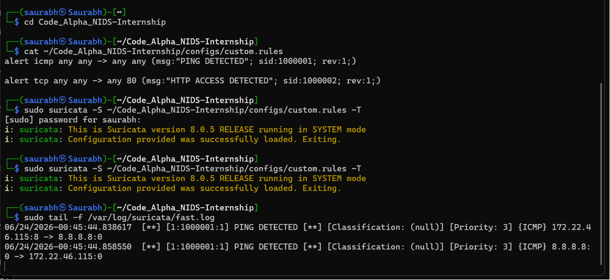
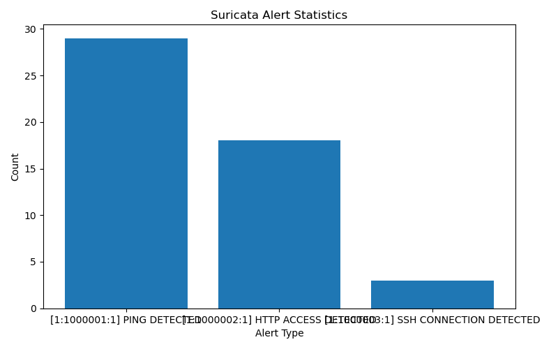

# -Code_Alpha_NIDS-Internship
# Network Intrusion Detection System (NIDS)

## Overview

This project implements a Network Intrusion Detection System (NIDS) using Suricata to monitor network traffic, detect suspicious activities, generate alerts, and visualize attack statistics.

## Features

* Real-time network traffic monitoring
* Custom Suricata detection rules
* ICMP (Ping) detection
* HTTP traffic detection
* SSH connection detection
* Automated alert monitoring
* Dashboard visualization using Python and Matplotlib

## Technologies Used

* Kali Linux (WSL)
* Suricata IDS
* Python
* Git & GitHub
* Pandas
* Matplotlib

## Project Architecture

Network Traffic → Suricata → Detection Rules → Alerts → Response Script → Dashboard

## Screenshots

### Suricata Running

### Alert Detection

### Traffic Generation

### Dashboard

## Results

Successfully detected:

- ICMP Ping Traffic
- HTTP Connections
- SSH Connections

Generated real-time alerts using Suricata and visualized attack statistics using Python and Matplotlib.

## Achievements

- Built a Network Intrusion Detection System using Suricata
- Implemented custom detection rules
- Monitored network traffic in real time
- Generated automated alerts
- Created a visualization dashboard

## Future Improvements

* Email notifications
* Telegram alerts
* Real-time web dashboard
* ## Achievements

- Built a Network Intrusion Detection System using Suricata
- Implemented custom detection rules
- Monitored network traffic in real time
- Generated automated alerts
- Created a visualization dashboardMachine learning based anomaly detection
 
